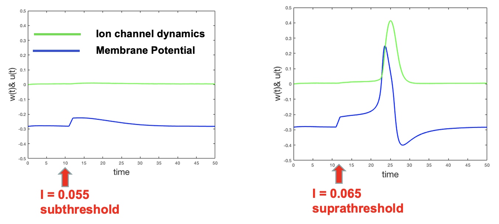
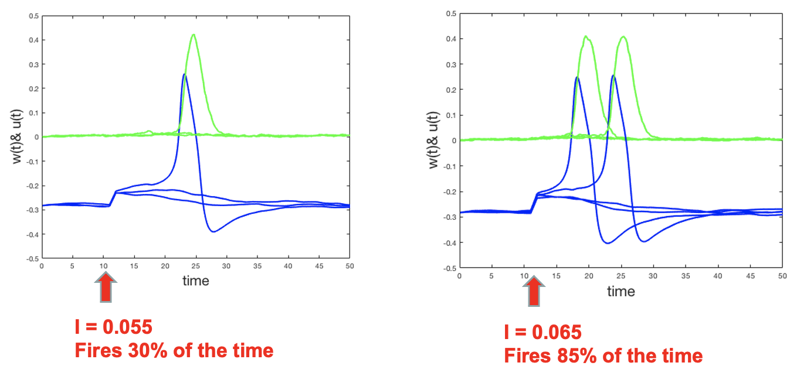
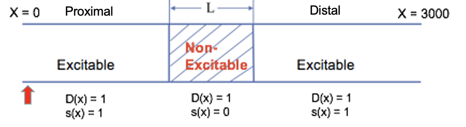
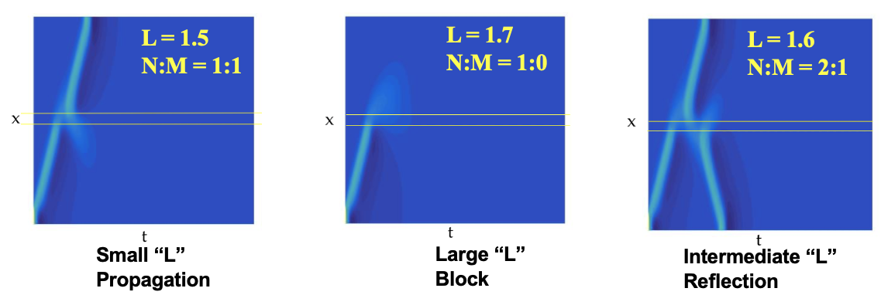
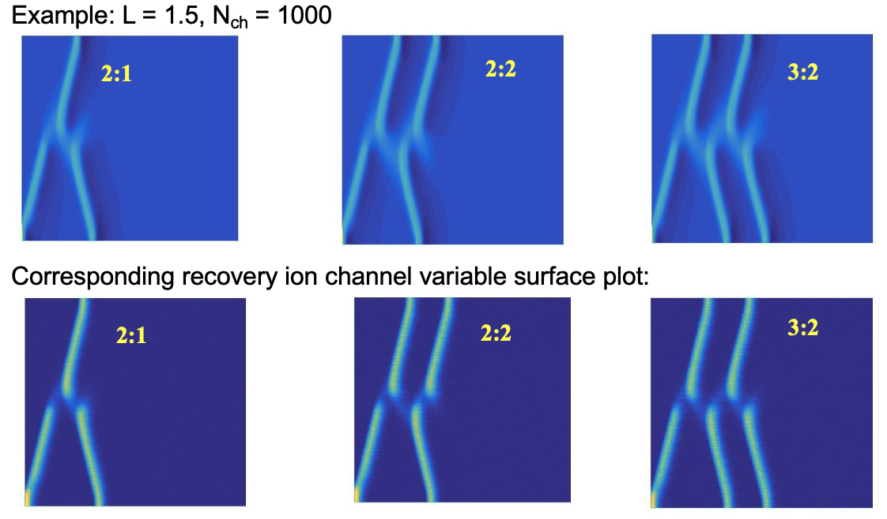

```{r setup, include=FALSE}
knitr::opts_chunk$set(echo = TRUE)
```

## Background 

* Sudden cardiac arrest (SCA) is the leading cause of natural death in the United States. SCA most often results from aberrant heart rhythms, known as arrhythmias, which can be triggered by the presence of myocardial ischemia.  
* Ischemic regions have been shown to give to rise to reflected waves, i.e., a wave propagation in one direction induces another wave to travel in retrograde direction.  
* Reflected waves have been linked to the onset of life threatening cardiac arrest.  
* Here we constructed an idealized model of heart tissue with an ischemic region ("Gap" model) and examine how stochastic ion channel dynamics can affect the propensity of reflected waves.

## Single cardiac cell model

$$
\begin{align}
\frac{\partial u}{\partial t} &= f(u,w) = I - g_{Ca} m_{\infty} (u - E_{K}) - g_{K} m_{\infty} (u - E_{K}) - g_{L} (u - E_{L}) \\
\frac{\partial w}{\partial t} &= g(u, w) =  \alpha(u)(1-w) - \beta(u) w 
\end{align}
$$

The following is an illustrative picture modeling ion channel dynamics:

<p align="center">

</p>

### Determinstic case

Cardiac cell can be excited by a "current" that passes some threshold

<p align="center">

</p>

Here we simulate 1000 cardiac cells, then the probability of cell firing changes as the strength of current.

<p align="center">

</p>

## 1D cardiac tissue model

1D Reaction diffusion model capture the spatiotemporal behavior of the heart tissue:
$$
\begin{align}
u_t &= f(u,w) = (D(x) u_x)_x + s(x) f(u, w) \\
w_t &= g(u, w)
\end{align}
$$

Illustrative picture:

<p align="center">

</p>

## Simulate wave propagation through ischemic tissue

We excite the cable from the proximal side to generate a wave of excitation and prescribe three different lengths of ischemic tissue (gap). We use N:M to denote the wave pattern on the panel, where N is the number of waves on the proximal side of the gap, and M is the number of waves on the distal side. 

### Deterministic case

membrane potential surface plot displayed below

<p align="center">

</p>

### Stochastic case

Stochastic property will manifest itself when the number of ion channels is relatively low. We experiment with the system using ion channel numbers ranging from 10 to 1000 for each prescribed gap length.

<p align="center">

</p>

## Conclusion

This "Gap" model for cardiac ischemic region shows:  

* The finely tuned gap length of ischemic region between 1.5 and 1.7 could by itself give rise to reflected waves.  
* Turning on the stochastic property of ion channels can also increase the frequency of more reflected waves occurring as the number of channels per cell decreases even for L=1.5 and L=1.7.  
* The presence of reflected waves could potentially lead to any type of cardiac arrhythmias because it disrupts the electrical coordination of cardiac tissue in the real heart. 

